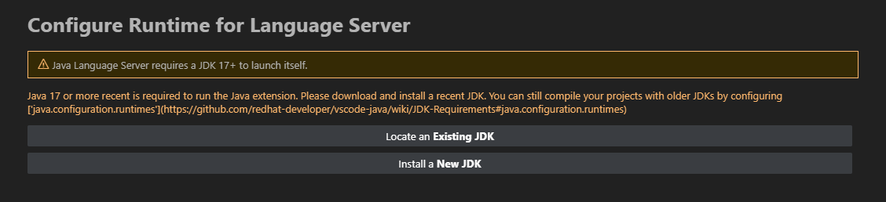
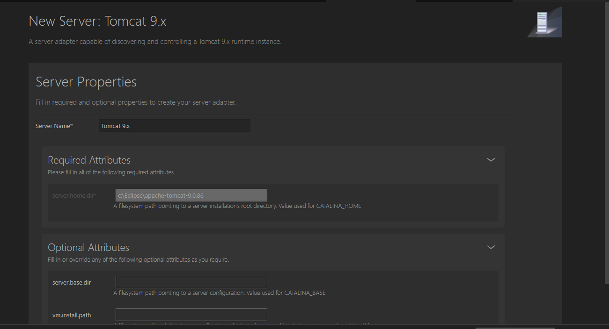

# Java Spring MVC Project with Tomcat 

- Mẫu JavaMVC chạy bằng server Tomcat
- Yêu cầu: jdk1.8(for tomcat), java phiên bản >= 9(dùng cho cho rsp/Community Server Connectors), tomcat, mssql server với database TESTDB(mẫu ở trong thư mục, tên db.sql).

# Cách dùng
Note: Ở lần chạy thứ 2 trở đi, có thể có bảng cảnh báo "Run time need JDK 17+" như sau, chỉ cần bỏ qua nó:


1. Tải Extension Pack for Java, Community Server Connectors trong VSCode Extensions.
2. Tải [jdk1.8](https://www.oracle.com/java/technologies/javase/javase8-archive-downloads.html) (cần thiết, bỏ qua nếu có bản 1.8 rồi).
3. Ở phần Explorer (Ctrl+Shift+E), tag "Server", thêm tomcat server (use server on disk) hoặc tải bản tomcat mới, khuyến nghị tomcat 8.5.
4. Lần đầu mở project, cần build lại toàn bộ dự án bằng build task (ctrl + shift + b) hoặc trình xây dựng của bạn(maven, ...). Sau đó, trừ khi có lượng thay đổi lớn hoặc tương tự, bạn chỉ cần save file là nó sẽ tự comp thành class.
5. Chuột phải vào thư mục dự án (src/main/webapp) và chọn "Run on server" để deploy sản phẩm.
   - Chọn server: server của bạn, hoặc tạo mới nếu cần
   - Thêm param: thêm để có tên của sản phẩm, mặc định là "webapp"
   - Project name: để trống

6. Mở trình duyệt và truy cập http://localhost:8080/<your_project_name>
7. Hot reload(đã cài sẵn, nếu k hoạt động hãy cài thủ công như dưới): 
   1. Ở explorer, tìm tag "JAVA PROJECTS" -> click on "..." -> chọn "Configure Classpath " -> sửa output path thành "src/main/webapp/WEB-INF/classes" -> Save -> Apply.
   2. Trong cài đặt, tìm "Java: Auto Build" -> check.
   3. Trong cài đặt, tìm "java.debug.settings.hotCodeReplace" -> chỉnh thành "auto".
   4. Trong cài đặt, tìm "java.configuration.updateBuildConfiguration" -> chỉnh thành "automatic"
8. Setup database: xem src/main/webapp/WEB-INF/configs/spring-config-hibernate.xml.example (sao chép và đổi tên, xóa đuôi example là được)

# Cài đặt cần thiết

## 1. Tomcat

- Setup vm.install.path
  - Với tomcat của bạn: khi cài đặt, nó sẽ hiện thông báo, chỉnh sửa field "vm.install.path" đến thư mục jdk của bạn(1.8).
    
  - Với tomcat tải về từ server: chuột phải vào server -> Edit Server...
    Nó sẽ mở 1 file json, tìm "vm.install.path" và sửa đến thư mục jdk của bạn(1.8).

## 2. Email
- Kiểm tra file spring-config-gmail.xml
# NOTE

## 1. Đổi cổng ra (port)

- Ở tag Server, chuột phải vào server và chọn "Server Actions..."
- Chọn "Edit Configuration File"
- Chọn conf/server.xml
- Tìm "Connector port=" và đổi đến port bạn muốn.
- Restart/start server.

## 2. Cách deploy đơn giản nhất

- Khi cài server, nếu không thêm param hay port, đường dẫn đến sản phẩm sẽ là: http://localhost:8080/webapp

## 3. Đổi tên, dường dẫn thư mục webapp

- Cần đổi cả thư mục classes
- Sửa ở .vscode/.settings.
- Cây thư mục dự án:

```
|___src
|      |_main
|      |_java
|      |  |_<controller_package>
|      |
|      |_webapp
|           |_WEB-INF
|               |_classes
|               |_lib
|               |_web.xml
|               |_index.jsp
|               |_...

```

## 5. Lỗi Community Server Connectors

- Có thể do java version. Cần cài bản java >= 9. Kiểm tra JAVA_HOME ở system environment variables nếu đã cài.

## 6. Bug với Tomcat

- Server log :

```
java.lang.ExceptionInInitializerError: Exception java.lang.ExceptionInInitializerError [in thread "localhost-startStop-1"]
	org.springframework.cglib.core.KeyFactory$Generator.generateClass(KeyFactory.java:166)
	org.springframework.cglib.core.DefaultGeneratorStrategy.generate(DefaultGeneratorStrategy.java:25)
	org.springframework.cglib.core.AbstractClassGenerator.create(AbstractClassGenerator.java:216)
	org.springframework.cglib.core.KeyFactory$Generator.create(KeyFactory.java:144)
	org.springframework.cglib.core.KeyFactory.create(KeyFactory.java:116)
	org.springframework.cglib.core.KeyFactory.create(KeyFactory.java:108)
	org.springframework.cglib.core.KeyFactory.create(KeyFactory.java:104)
	org.springframework.cglib.proxy.Enhancer.<clinit>(Enhancer.java:69)
	org.springframework.aop.framework.CglibAopProxy.createEnhancer(CglibAopProxy.java:234)
	org.springframework.aop.framework.CglibAopProxy.getProxy(CglibAopProxy.java:177)
	org.springframework.aop.framework.ProxyFactory.getProxy(ProxyFactory.java:111)
	org.springframework.aop.framework.autoproxy.AbstractAutoProxyCreator.createProxy(AbstractAutoProxyCreator.java:490)
	org.springframework.aop.framework.autoproxy.AbstractAutoProxyCreator.wrapIfNecessary(AbstractAutoProxyCreator.java:375)
	org.springframework.aop.framework.autoproxy.AbstractAutoProxyCreator.postProcessAfterInitialization(AbstractAutoProxyCreator.java:335)
```

- Lỗi này là do phiên bản java dùng cho server. Cần đổi phiên bản java thành 1.8. Check phần **##2. Tomcat** để biết thêm.

## 7. Run/Debug

- Server cần ở trạng thái "Started(hoặc Debugging), Synchronized" để chạy/debug.
- Ở debugmode, có thể hot reload tự động, tuy nhiên, nếu có chỉnh sửa ở Bean hoặc phần khởi tạo dữ liệu, cần khởi động lại server, hoặc tắt server hẳn rồi bật lại.

## 8. Java issues
- Lỗi ở java bean:


- Clear cache và cầu nguyện ╰(*°▽°*)╯.
